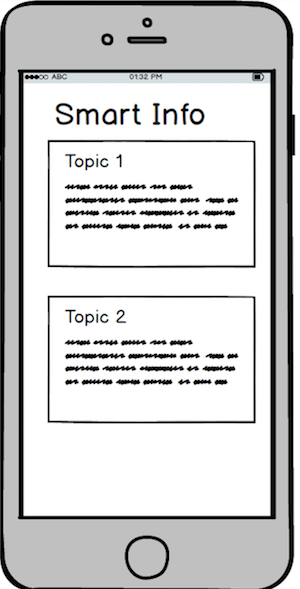
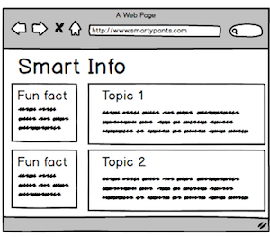

# Grid System

### Coding Dojo Course Practice

### Why use the grid system?

To streamline the process of designing responsive websites, many developers choose to imagine that the screen is divided vertically into evenly distributed columns. Combined with dividing the screen into horizontal rows, this makes positioning our elements on the page much easier!


Here, we’ve thought about our website design with mobile first. We would want our data to be displayed very simply; just a vertical list that a user can easily scroll through on a phone. Using the grid idea, each topic gets all the available columns. For this example, assume that we are dividing our screen into four columns. Each column, therefore, gets 25% of the available width.




Now, we can think about a larger device. If we have more space, we can add a fun fact to each row. We’ll give one column of the available four to this extra content and leave the remaining three for the main content.




This means that in our html, we’ll give our elements different classes. Our classes will follow the pattern **screen size - number of columns**. For example, a class of ```.med-1``` will mean that for medium screens, the element will take up one column.


```
<div class="col sm-0 med-1">
   <h5>Did you know?</h5>
   <p>If you could fold a piece of paper 42 times, it would be tall enough to reach the moon.</p>
</div>
```

In our css, we’ll perform media queries that determine which classes we are using and which we are ignoring, depending on the screen size.

```
@media only screen and (max-width: 480px){
    .sm-0 {
        /* we will not display anything with the class .sm-0 if the screen's width is less than 480px */
        display: none;
     }
}
@media only screen and (min-width: 481px){
    .med-1 {
        /* anything with the class .med-1 will get 25% of the available width if the screen's width is greater than 480px */
        width: 25%;
    }
}
```
